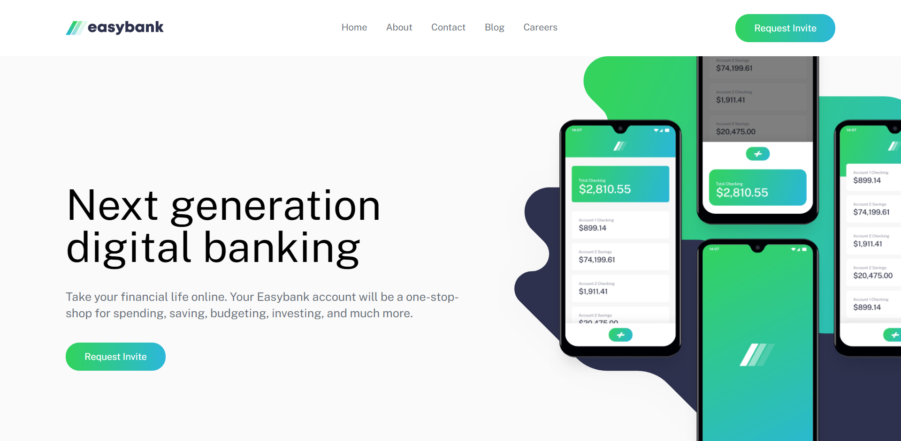

# Frontend Mentor - Easybank landing page solution

This is a solution to the [Easybank landing page challenge on Frontend Mentor](https://www.frontendmentor.io/challenges/easybank-landing-page-WaUhkoDN). Frontend Mentor challenges help you improve your coding skills by building realistic projects. 

### The challenge

Users should be able to:

- View the optimal layout for the site depending on their device's screen size
- See hover states for all interactive elements on the page

### Built with

- Semantic HTML5 markup
- [tailwindcss](https://tailwindcss.com/) - CSS framework

### Links

- Live Site URL: [Easybank](https://tailwindpractice-easybank.netlify.app/)

### Screenshot

